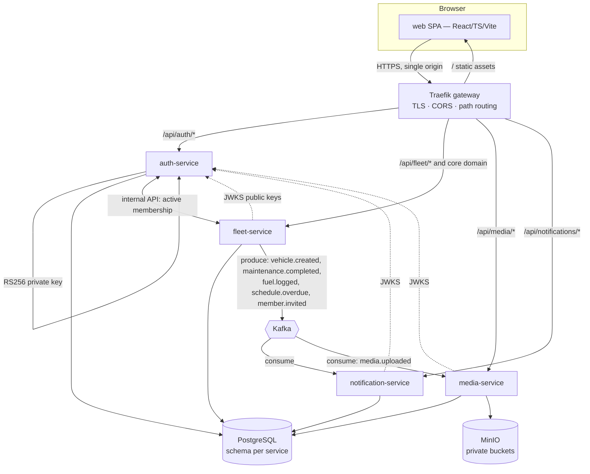

# Household Vehicle Management Platform — MVP Architecture & Design

Version: v1
Status: Proposed
Created: 2026-05-24
PRD: `docs/tasks/task-001-household-vehicle-platform/prd.md`
Roadmap (delivery slices): `docs/roadmap.md`

---

## 0. How to read this document

This is the **full-MVP design** for the Household Vehicle Management Platform. The PRD says
*what* the platform must do; this document says *how* — component decomposition, data flow, key
algorithms, error handling, observability, and testing — across every service and the web app.

`task-001` is the **anchor task**: it owns the comprehensive PRD, this design, and the roadmap.
Actual build work is sliced into `task-002 … task-012` (see `docs/roadmap.md`), each of which gets
its own `/spec-task → /design-task → /plan-task → /execute-task` cycle. Those per-slice designs
**inherit and refine** this document; they must not contradict the cross-cutting decisions fixed
here without explicitly revisiting this design. §19 maps each design section to the roadmap task
that implements it.

Where this design and the PRD's open questions (§9 of the PRD) conflict, **this document
resolves them** (see §3 and §18).

---

## 1. Scope and non-goals of this design

In scope: the platform topology; monorepo layout; shared packages; the canonical backend service
template and per-service designs (auth, fleet, media, notification); the event-driven backbone;
authn/authz end-to-end; the key domain algorithms (recurrence, status derivation, completion,
dedupe, presigned media); background jobs; the frontend architecture; deployment, CI/CD, and
observability.

Out of scope (same as PRD non-goals): native mobile, OCR/AI extraction, predictive maintenance,
marketplace/telemetry/VIN integrations, email/push notifications, ad-hoc BI. Also out of scope for
*this* document: exhaustive field-level UI copy, final Kubernetes resource sizing, and load-test
numbers — those are refined in the relevant slice tasks.

---

## 2. System topology



Single origin: the browser talks only to the gateway. The gateway terminates TLS and CORS and
routes by path prefix. Every service independently validates the first-party JWT using
auth-service's published JWKS (decision in §3, detail in §9). Services never share a database; they
reference each other's entities by id and resolve them at the application layer (PRD D2).

Backing infrastructure (local: docker-compose; deployed: k3s): **PostgreSQL** (one instance,
isolated database/schema per service), **MinIO** (private object storage), **Kafka** (event bus).

---

## 3. Cross-cutting architecture decisions

The PRD fixed four (D1–D4). This design adopts them verbatim and resolves the PRD §9 open
questions. Rationale is recorded so slice tasks don't relitigate.

| ID | Decision | Rationale |
|----|----------|-----------|
| D1 | `fleet-service` owns the entire core domain; `auth`/`media`/`notification` stay narrow. | One transactional boundary for tightly-coupled domain (vehicles ↔ mileage ↔ maintenance ↔ status ↔ activity); avoids distributed transactions across the hot path. |
| D2 | One PostgreSQL instance, **isolated database/schema per service**; no cross-service joins. | Service autonomy + a single ops surface for the MVP. Cross-boundary links are id references resolved via internal APIs. |
| D3 | `auth-service` verifies Google OIDC and mints first-party JWTs; all services validate them. | Decouples the rest of the platform from the IdP; keeps an OIDC-compatible seam for future providers (PRD FR-AUTH-1). |
| D4 | Single-origin **Traefik** gateway routes by path prefix; TLS/CORS centralized at the edge. | Traefik is k3s's bundled ingress; same config model locally and deployed. |
| **A1** | **Native workspaces** — Go workspaces (`go.work`) + npm workspaces. Build orchestration via `Makefile` + `scripts/`. | Backend is Go-primary with a single React app; Turborepo/Nx caching buys little here and adds tooling. |
| **A2** | **JWT validation in a shared Go middleware in each service**, not edge `forwardAuth`. Traefik does TLS/CORS/routing only. | Claims (esp. fleet/role) are needed where the data lives; per-service validation is defense-in-depth and avoids a per-request hop to auth. |
| **A3** | **Asymmetric RS256 + JWKS.** auth-service holds the private key and serves `/.well-known/jwks.json`; others validate with cached public keys. Access token ~15 min; rotating refresh ~30 d. | No shared signing secret; supports key rotation; short access tokens bound staleness of fleet/role claims. |
| **A4** | **Page-number pagination** (`page[number]`/`page[size]`) standardized across all collection endpoints, with `meta.total`/`meta.totalPages` and `links`. | Household datasets are small (deep-offset cost is a non-issue); enables "page X of Y" UI and totals. Cursor reserved for future scale. |
| **A5** | **Dashboard aggregations computed on read** (no precompute/materialized views for MVP), behind indexes; `GET` responses cached briefly client-side via React Query. | Single-household data volume keeps P95 < 300 ms achievable; avoids a precompute pipeline. Revisit if a fleet's history grows large. |
| **A6** | **Notifications: event-driven + a daily safety-net scan.** Overdue/upcoming transitions emit events consumed into notifications; a daily job re-derives due state as a backstop. Dedupe per `(trigger, due-cycle)`. | Matches PRD idempotency (FR-NOTIF-3) without double-firing. |
| **A7** | **media-service processes image variants in an in-process Kafka consumer (worker goroutines)**, separate from the HTTP request path; splittable into its own deployment later. | Satisfies "async, must not block requests" (PRD NFR) without a premature separate service. |
| **A8** | **Transactional outbox** in event-producing services (fleet-service first): events are written to an `outbox` table in the same DB transaction as the domain change; a relay publishes to Kafka and marks them sent. | Guarantees no lost/orphan events across the DB↔Kafka boundary. |
| **A9** | **Background jobs are guarded by a Postgres advisory lock** (leader-lite). Job-running services may scale, but only the lock holder runs the sweep. | Idempotent, retry-safe, multi-replica-safe scheduling (PRD NFR) without external coordination. |

Reconciliations with the backend skill's scaffolding examples: the skill shows `services/<name>/`
+ Nginx + `/api/v1/...`. **This design uses the PRD-fixed layout** (`apps/<service>`,
`packages/<lib>`), **Traefik** (not Nginx), and the PRD's **`/api/<service>/*`** path prefixes
(no `/v1`). The skill's *internal domain-package layering* (model/entity/builder/processor/
provider/administrator/resource/rest) is preserved unchanged.

---

## 4. Repository & monorepo layout

```
/
├── go.work                      # lists every Go module under apps/ and packages/
├── package.json                 # npm workspaces root
├── Makefile                     # build/test/lint/dev orchestration
├── apps/
│   ├── auth-service/            # Go module: github.com/jtumidanski/myfleet/apps/auth-service
│   ├── fleet-service/           # Go module
│   ├── media-service/           # Go module
│   ├── notification-service/    # Go module
│   └── web/                     # React/TS/Vite app (npm workspace)
├── packages/
│   ├── shared-go/               # Go module: server, db, jwt-middleware, otel, logging, jobs
│   ├── dto-go/                  # Go module: JSON:API transport DTOs shared across services
│   ├── shared-ts/               # api client, error mapping, JSON:API types
│   └── ui-components/           # shared React components (shadcn-based)
├── deploy/
│   ├── compose/                 # docker-compose.yml + traefik config + .env.example
│   └── k8s/                     # k3s manifests (per service + infra), Kustomize base/overlays
├── scripts/                     # build-<svc>.sh, dev bootstrap, seed, migration helpers
└── docs/                        # PRD, roadmap, per-task docs, service READMEs
```

- **Go module namespace:** `github.com/jtumidanski/myfleet/...`. Each app and each Go package is
  its own module, wired together by `go.work`.
- **npm workspaces:** root `package.json` lists `apps/web`, `packages/shared-ts`,
  `packages/ui-components`.
- **GHCR images:** `ghcr.io/jtumidanski/myfleet-<service>:<tag>`.

Each backend service directory follows the skill's scaffolding structure (`cmd/main.go`,
`internal/<domain>/...`, `migrations/`, `Dockerfile`) — see §6.

---

## 5. Shared packages

### `packages/shared-go`
The backbone reused by every Go service. Modules:
- **`server`** — HTTP server bootstrap, route-initializer registration, `RegisterHandler` /
  `RegisterInputHandler[T]` helpers, JSON:API request/response plumbing, the standard error
  envelope, and the **page-number pagination** helper (parse `page[number]`/`page[size]`, emit
  `meta`/`links`).
- **`database`** — GORM connection, `SetMigrations` option, `Query`/`SliceQuery` lazy providers,
  advisory-lock helper (`WithLeaderLock(name, fn)`), UUID generation helpers.
- **`auth`** — JWT-validation middleware: fetches and caches JWKS from auth-service, validates
  RS256 signature/exp/aud/iss, parses claims into a typed `Identity` (`UserID`, `Email`,
  `ActiveFleetID`, `Role`) placed on request context. Provides `RequireRole(...)` guards.
- **`telemetry`** — logrus structured logging, OpenTelemetry tracer setup, **correlation-ID**
  middleware (propagates `X-Correlation-ID`/`traceparent` across HTTP and into Kafka headers).
- **`events`** — Kafka producer/consumer wrappers, the **event envelope** type (§7), idempotent-
  consumer scaffold (dedupe table helper), and the **outbox** relay.
- **`jobs`** — scheduler primitive (ticker/cron) that runs a function under the advisory lock.
- **`health`** — `/healthz` (liveness), `/readyz` (readiness: DB ping + dependency checks),
  `/metrics` (Prometheus).

### `packages/dto-go`
Transport DTOs (JSON:API attribute structs) shared between services and used by their `rest.go`
mappers. Keeping DTOs here lets a consumer service (e.g. notification reading a fleet event payload)
share the exact shape without importing another service's `internal/`. **Domain models stay private
to each service** — only DTOs are shared (honors PRD's "don't break service boundaries").

### `packages/shared-ts`
- **`apiClient`** — singleton fetch client: base URL, JWT attach, refresh-on-401, request dedup,
  retry/backoff, JSON:API (de)serialization.
- **`errors`** — `createErrorFromUnknown()` and error classification mapping the backend error
  envelope to typed UI errors.
- **`jsonapi`** — `{ id, attributes, relationships }` types + helpers; page-number pagination types.

### `packages/ui-components`
shadcn/ui-based shared primitives and composed components reused across features (status badge,
severity chip, money/mileage formatters, skeleton wrappers, the widget frame). Consumed by
`apps/web`.

---

## 6. Backend service template (the canonical Go service)

Every Go service is built from the same layered template (from `backend-dev-guidelines`). A
**domain package** under `internal/<domain>/` contains:

| File | Responsibility |
|------|----------------|
| `model.go` | Immutable domain model + accessors. State changes return new instances. |
| `entity.go` | GORM entity with tags + migrations; `Make(Entity) Model` and `ToEntity() Entity`. |
| `builder.go` | Fluent builder enforcing invariants via `Build()`. |
| `processor.go` | Pure business logic; constructor takes `logrus.FieldLogger` + providers. |
| `provider.go` | Lazy data access via `database.Query`/`SliceQuery`. |
| `administrator.go` | Write/orchestration operations (create/update/delete sequences). |
| `resource.go` | Route registration + handlers; uses `RegisterInputHandler[T]`, passes `d.Logger()`, checks Transform errors. |
| `rest.go` | JSON:API mapping: `Transform` + `TransformSlice`. |

Layer rules enforced platform-wide:
- **Domain → Infrastructure → Transport → Application** separation; logic is pure and
  side-effect-free where possible.
- **Cross-domain orchestration lives in processors**, not handlers (e.g. logging a fuel entry also
  creating a mileage record is orchestrated in the fuel processor calling the mileage processor).
  The only exception is read-only aggregation handlers (dashboard) which may call multiple
  processors directly.
- **Stateless services**; all state in PostgreSQL/MinIO.
- **UUID primary keys** generated in-app; **migrations run on startup**; **soft-delete** via
  `deleted_at` where the PRD specifies.

Application bootstrap (per `cmd/main.go`):
```go
cfg := config.Load()                       // env only; no os.Getenv in handlers
logger := telemetry.NewLogger(cfg)
tracer := telemetry.InitTracer(cfg)
db := database.Connect(logger, database.SetMigrations(domainA.Migration, domainB.Migration, ...))
events := events.NewProducer(cfg)          // + outbox relay where applicable
server.New(logger).
  Use(telemetry.CorrelationID, auth.JWT(jwks)).
  AddRouteInitializer(domainA.InitializeRoutes(db, events)(GetServer())).
  AddRouteInitializer(domainB.InitializeRoutes(db, events)(GetServer())).
  WithHealth(health.Default(db)).
  Run()
```

### Standard error envelope & status codes (all services)
```json
{ "errors": [ { "status", "code", "title", "detail", "source": { "pointer": "/data/attributes/x" } } ] }
```
Canonical mapping: **401** missing/invalid JWT · **403** authenticated but role lacks permission ·
**404** resource not in caller's fleet (cross-fleet existence is never leaked) · **409** invite
already accepted/expired or same-email mismatch · **410** purged soft-deleted entity ·
**422** validation. This mapping is implemented once in `shared-go/server` and reused.

---

## 7. Event-driven backbone (Kafka)

### Envelope (in `shared-go/events`, mirrored as a `dto-go` type)
```json
{
  "event_id": "uuid",          // idempotency key
  "type": "maintenance.completed",
  "version": 1,
  "occurred_at": "RFC3339",
  "fleet_id": "uuid",
  "actor_user_id": "uuid",
  "trace_id": "...",           // correlation propagated from the originating request
  "data": { /* type-specific, defined in dto-go */ }
}
```

### Topics & flow
fleet-service **produces** (one topic per domain or a small set of typed topics):
`vehicle.created`, `maintenance.completed`, `fuel.logged`, `schedule.overdue`, `member.invited`.
media-service produces `media.uploaded`.

Consumers:
- **notification-service** consumes domain events → in-app notifications (alerts/reminders).
- **media-service** consumes `media.uploaded` → generates thumbnail/display variants (A7).

### Reliability
- **Producers** use the **outbox pattern (A8)**: the domain write and the event row commit in one
  transaction; a relay goroutine publishes unsent rows to Kafka and marks them sent (with the
  advisory lock so only one replica relays).
- **Consumers** are **idempotent (A6/PRD FR-NOTIF-3)**: each consumer records processed `event_id`s
  (a `processed_events` table) and/or upserts on a natural `dedupe_key`, so redelivery is a no-op.
- Failed handling retries with backoff; poison messages route to a dead-letter topic for inspection.

Earlier slice tasks (002–006) may **stub event emission behind the `events` interface** (no-op
producer) so they don't need Kafka wired before task-009 introduces real producers.

---

## 8. Per-service designs

### 8.1 auth-service

**Owns:** `users`, `refresh_tokens`. **Path:** `/api/auth/*`.

Domain packages: `user`, `session` (token issuance/refresh), `oidc` (Google verification), `jwks`.

OIDC + token flow:
```mermaid
sequenceDiagram
  participant B as Browser
  participant G as Gateway
  participant A as auth-service
  participant GG as Google OIDC
  participant F as fleet-service (internal)
  B->>G: GET /api/auth/login/google
  G->>A: route
  A-->>B: 302 to Google consent
  B->>GG: authenticate
  GG-->>A: GET /api/auth/callback?code
  A->>GG: exchange code, verify id_token (iss/aud/sig/nonce)
  A->>A: upsert user by google_sub (provision on first login)
  A->>F: GET /internal/memberships/active?user_id  (id-ref resolution)
  F-->>A: { fleet_id, role } or none
  A->>A: mint RS256 access (15m) + rotating refresh (30d, hashed)
  A-->>B: set tokens; redirect to app (onboarding if no fleet)
```

- **Provisioning** (FR-AUTH-2): keyed by Google `sub`; capture email, name, avatar; `last_login_at`.
- **Access token claims** (FR-AUTH-4): `sub`=user_id, `email`, `active_fleet_id` (nullable
  pre-onboarding), `role`, `iss`, `aud`, `exp`. auth-service obtains `active_fleet_id`/`role` from
  fleet-service's **internal membership endpoint** (allowed under D2 — an API call, not a DB join).
- **Refresh** (FR-AUTH-4): rotating, single-use refresh tokens stored **hashed**; reuse detection
  revokes the token family. `POST /auth/refresh` re-resolves active membership so role changes take
  effect within one access-token lifetime (≤15 min staleness — accepted for MVP, documented).
- **JWKS** (A3): `GET /.well-known/jwks.json` serves the current (and rotating) RS256 public keys.
- **`GET /auth/me`** returns profile + active fleet/role (FR-AUTH-3). `POST /auth/logout` revokes
  refresh tokens.
- **Set-active-fleet** (future many-to-many, FR-AUTH-5): an endpoint to switch active fleet → mint
  new token; MVP has exactly one membership so this is effectively a no-op but the seam exists.

### 8.2 fleet-service (the core domain)

**Owns** (D1) all of: `fleets`, `fleet_memberships`, `fleet_invites`, `vehicles`, `vehicle_media`,
`mileage_records`, `maintenance_categories`, `maintenance_records`, `maintenance_record_documents`,
`maintenance_schedules`, `fuel_logs`, `dashboards`, `dashboard_widgets`, `activity_events`,
plus `outbox` and `processed_events`. **Path:** `/api/fleet/*` and the core domain endpoints.

Domain packages (each the full file set from §6): `fleet`, `membership`, `invite`, `vehicle`,
`vehiclemedia`, `mileage`, `maintenancecategory`, `maintenancerecord`, `maintenanceschedule`,
`fuel`, `dashboard`, `activity`, `status` (derivation — see §10), and an internal `membership`
read endpoint for auth-service.

Key cross-domain orchestrations (in processors, per skill rule):
- **Fuel logged** → fuel processor calls mileage processor to append a `mileage_record`
  (source=`fuel`) and updates `vehicles.current_mileage`; emits `fuel.logged` via outbox.
- **Maintenance completed** → schedule processor creates a pre-populated `maintenance_record`,
  appends a `mileage_record` (source=`maintenance`), recomputes next-due (§10), and emits
  `maintenance.completed`.
- **Any mileage change** → triggers status re-derivation for the vehicle (§10) and may flip a
  schedule to overdue/upcoming (emits `schedule.overdue` when crossing).
- **Vehicle created / member invited** → emit `vehicle.created` / `member.invited`.

Activity (FR-ACT): every domain write that matters appends an append-only `activity_events` row
(actor, type, fleet_id, vehicle_id?, payload). Implemented as a small helper the processors call so
the feed and per-vehicle timeline are consistent.

**Internal endpoint:** `GET /internal/memberships/active?user_id=` (network-restricted, not exposed
through the public gateway path) returns the user's active `{fleet_id, role}` for token minting.

### 8.3 media-service

**Owns:** `media_objects`, `media_variants`. **Path:** `/api/media/*`. Storage: **MinIO**, private
buckets only.

Upload flow (presigned, keeps large bytes off the API path where possible):
```mermaid
sequenceDiagram
  participant B as Browser
  participant M as media-service
  participant S as MinIO
  participant K as Kafka
  B->>M: POST /media (init: filename, content-type, fleet from JWT)
  M->>M: create media_objects row (status=uploaded), object_key
  M-->>B: presigned PUT URL
  B->>S: PUT bytes
  B->>M: confirm upload
  M->>K: produce media.uploaded
  K->>M: consume (worker goroutines) → generate thumbnail + display variants
  M->>S: PUT variants; insert media_variants; status=ready
```
- **Download** (FR-MEDIA-3): `GET /media/{id}/download` returns a **short-lived presigned GET URL**
  after fleet-scoped authz; buckets are never public.
- **Variant processing** (A7, FR-MEDIA-4): in-process Kafka consumer worker pool; at least
  `thumbnail` + `display`. Decoupled from the request path.
- **Soft-delete + purge** (FR-MEDIA-3): `deleted_at` + `purge_after`; a job (A9) sweeps expired
  objects and their MinIO keys.
- **Metadata** (FR-MEDIA-2): owner, fleet, content type, size, original filename, status.
- fleet-service stores only `media_id` references (e.g. `vehicles.primary_image_media_id`,
  `vehicle_media`, `maintenance_record_documents`); the web app resolves them via media-service.

### 8.4 notification-service

**Owns:** `notifications`, `notification_preferences`. **Path:** `/api/notifications/*`.

- **Generation** (FR-NOTIF-3, A6): idempotent Kafka consumers turn `schedule.overdue`,
  upcoming-maintenance signals, and fleet-activity events into `notifications`, keyed by a
  **`dedupe_key`** unique per trigger+due-cycle. A **daily reminder job** (A9) re-derives
  upcoming/overdue as a safety net (catches schedules that became due purely by time passing).
- **Preferences** (FR-NOTIF-2): per-user, per-type enable/disable; generation respects them.
- **API:** `GET /notifications` (filter by read/type, page-number), `POST /notifications/{id}/read`,
  `POST /notifications/read-all`, `GET/PUT /notification-preferences`.
- Notifications are per-user; fleet scoping comes from the event's `fleet_id` + the user's
  membership (resolved from the event/notification's stored `user_id`).

---

## 9. Authentication & authorization (end to end)

1. **Edge (Traefik):** TLS + CORS + path routing. No token logic (A2).
2. **Per-service JWT middleware (`shared-go/auth`):** validates RS256 signature against cached
   **JWKS**, checks `exp`/`iss`/`aud`, and builds a typed `Identity` on context. Missing/invalid →
   **401**. Public exceptions: the OAuth handshake endpoints and JWKS.
3. **Fleet-scoped authorization (every resource access):**
   - The resource's stored `fleet_id` must equal the token's `active_fleet_id`; otherwise **404**
     (never 403 — don't leak cross-fleet existence; PRD §5.1).
   - **Role gate:** viewer = read-only (writes → **403**); member = domain writes; owner-only
     actions (rename fleet, remove member, restore vehicle, manage invites) → **403** for non-owners.
   - **fleet-service uses its own membership table as the authoritative role source** for owner-only
     actions (token role may be ≤15 min stale). media/notification trust the token's role/fleet
     claim (acceptable given short token life).
4. **Invite acceptance (FR-FLEET-3):** same-email enforcement — the authenticated Google email must
   match the invited email; expired/used → **409**.
5. **Sole-owner guard (FR-FLEET-4):** an owner cannot remove themselves if they are the only owner.

---

## 10. Key domain algorithms (fleet-service)

### 10.1 Recurrence & next-due (FR-MAINT-3/5/6)
A `maintenance_schedule` has `recurrence_type ∈ {time, mileage, hybrid}`, `interval_months`,
`interval_miles`, and `last_completed_{date,mileage}`.
- **next_due_date** = `last_completed_date + interval_months` (time/hybrid).
- **next_due_mileage** = `last_completed_mileage + interval_miles` (mileage/hybrid).
- **hybrid** = whichever threshold is reached first.
- **Due state** (recomputed on mileage change and by a periodic job, FR-MAINT-6):
  - `overdue` if `today > next_due_date` (time/hybrid) **or** `current_mileage > next_due_mileage` (mileage/hybrid).
  - `upcoming` if within the **due-soon thresholds** (default **30 days** or **500 mi**, configurable — same thresholds feed status §10.2).
  - else `ok`.
- **Severity** (Informational / Recommended / Urgent, FR-MAINT-4): derived from how far past/near
  due — e.g. upcoming→Informational, near-threshold→Recommended, overdue→Urgent (exact bands are a
  config table, tunable in the maintenance slice).

### 10.2 Vehicle status derivation (FR-STATUS, highest-priority wins)
Pure function over a vehicle's schedules + last activity:
1. any schedule `overdue` → **Overdue**
2. else any schedule `upcoming` (within 30 d / 500 mi default) → **Upcoming Maintenance**
3. else no activity/records within the inactivity window (default **365 d**) → **Inactive**
4. else → **Healthy**

Status is **never stored as a settable field** — it's derived on read and on mileage/schedule
change. Thresholds are configuration, not hardcoded.

### 10.3 Completion flow (FR-MAINT-5)
`POST /maintenance-schedules/{id}/complete`: create a `maintenance_record` pre-filled with
`{date=today, mileage=latest, category}`, append a mileage record, set
`last_completed_{date,mileage}`, recompute next-due (10.1), re-derive status (10.2), append an
activity event, and emit `maintenance.completed`.

### 10.4 Latest-mileage (FR-MILE)
`mileage_records` is append-only with `source ∈ {fuel, maintenance, manual}` and a `source_ref_id`.
`vehicles.current_mileage` mirrors the latest record. Forms auto-fill from latest; the trend graph
reads the chronological series.

### 10.5 Fuel price derivation (FR-FUEL-1)
If `price_per_gallon` omitted → `total_cost / gallons`; if `total_cost` omitted →
`price_per_gallon * gallons`. Reject if neither pair is derivable (422).

### 10.6 Soft-delete & purge (FR-VEH-4, FR-MEDIA-3)
Soft-deleted entities carry `purge_after` (e.g. `deleted_at + 5d` for vehicles). Restore is
owner-only and only valid before purge; accessing a purged entity → **410**. A purge job (A9) sweeps
expired rows (and, for media, their MinIO keys).

---

## 11. Background jobs

All jobs run via `shared-go/jobs` under a **Postgres advisory lock (A9)** so only one replica
executes a given sweep; all are idempotent and observable (logged, traced, metric-counted).

| Job | Service | Cadence | Idempotency |
|-----|---------|---------|-------------|
| Recurrence recompute / due-state refresh | fleet | periodic (e.g. hourly) + on mileage change | recompute is a pure overwrite of derived fields |
| Soft-delete purge (vehicles, media metadata) | fleet, media | daily | deletes only rows past `purge_after` |
| Outbox relay (publish unsent events) | fleet (+ any producer) | continuous/short interval | marks rows sent; re-publish is deduped by consumers |
| Image variant processing | media | event-driven worker pool | keyed by `media_object_id`; re-run overwrites variants |
| Reminder generation (daily safety-net) | notification | daily | `dedupe_key` per trigger+due-cycle |

---

## 12. Frontend architecture (`apps/web`)

Stack (PRD + frontend-dev-guidelines): React + TypeScript (strict, no `any`) + Vite, shadcn/ui +
Tailwind, TanStack React Query, react-hook-form + Zod. Desktop-first, responsive.

Internal structure (skill layout under `apps/web/src/`):
```
src/
├── pages/                 # route pages: data fetching + layout + composition
├── components/
│   ├── ui/                # shadcn primitives
│   ├── common/            # shared presentational
│   ├── features/          # feature containers (vehicles, maintenance, dashboard, ...)
│   └── providers/         # context provider wrappers (auth, query client)
├── lib/
│   ├── api/               # client (from shared-ts), errors
│   ├── hooks/api/         # React Query hooks: query-key factories, queries, mutations
│   └── schemas/           # Zod schemas (never inline in components)
├── services/api/          # BaseService + concrete services per resource
├── types/{models,api}/    # JSON:API model interfaces + API types
└── context/               # React context definitions
```

Conventions (enforced platform-wide):
- **Server state via React Query only**; hierarchical query-key factories (`as const`); mutations
  invalidate the right keys.
- **JSON:API models** as `{ id, attributes, relationships }`, matching backend `rest.go` output;
  page-number pagination surfaced via `meta`.
- **Forms** use react-hook-form + `zodResolver`; schemas live in `lib/schemas/`.
- **Loading** = skeletons (not spinners, except submit buttons); **errors** = `createErrorFromUnknown()`
  + sonner toasts; conditional classes via `cn()`.
- **Auth integration:** the API client attaches the JWT and transparently refreshes on 401 (via
  `shared-ts`); an auth context gates routes and exposes active fleet/role to drive role-based UI
  (hide owner-only actions for members/viewers — server still enforces).

Feature areas map to PRD: onboarding & fleet settings, vehicles (CRUD + media gallery + primary
image), mileage (history + trend graph + auto-fill), maintenance (records, schedules, upcoming/
overdue queues, complete action), fuel, activity feed/timeline, notifications + preferences, and the
**dashboard**.

### Dashboard widget system (FR-DASH)
Per-user, per-fleet layout persisted via `GET/PUT /fleets/{id}/dashboard` (the `dashboards` /
`dashboard_widgets` tables). A widget registry maps `type` → component + default size; a
grid layout supports add/remove/reorder/resize; each widget fetches its own data via its query hook.
Catalog (MVP, predefined only — no ad-hoc BI): Fleet overview, Vehicle status cards, Upcoming
maintenance, Overdue maintenance, Recent activity, Spend by vehicle, Mileage trends. Aggregation
widgets compute on read (A5) with selectable ranges where relevant.

---

## 13. Data model

The authoritative table list is **PRD §6** (per service). This design adds, per producer service:
- `outbox` (event_id, type, payload jsonb, occurred_at, sent_at) — fleet-service (and any future
  producer).
- `processed_events` (event_id PK, consumer, processed_at) — notification-service and media-service.

All tables: **UUID PKs generated in-app**, GORM auto-migrations on startup, `deleted_at` where the
PRD marks soft-delete, indexes on fleet-scoping FKs and on time-ordered columns for
append-only/timeline tables (`mileage_records.recorded_at`, `activity_events.created_at`). Referential
integrity is enforced **within** each service DB only; cross-service links are id references (D2).
`maintenance_categories` is **seeded via migration** (FR-MAINT-1).

---

## 14. Error handling & edge cases

| Case | Behavior |
|------|----------|
| Missing/invalid/expired JWT | 401; client auto-refreshes once, then redirects to login |
| Resource in another fleet | 404 (no existence leak) |
| Viewer attempts write / member attempts owner-only | 403 |
| Invite expired/already accepted | 409 |
| Invite email ≠ authenticated Google email | 409 (same-email enforcement) |
| Access to purged soft-deleted entity | 410 |
| Validation failure (e.g. fuel with no derivable price) | 422 with `source.pointer` |
| Sole owner self-removal | 409/403 with explanatory detail |
| Duplicate event redelivery | consumer no-ops via `dedupe_key`/`processed_events` |
| MinIO/Kafka transient failure | retry with backoff; outbox/DLQ prevent loss; request paths degrade gracefully |
| Mileage entered below latest | allowed but flagged (corrections happen); never silently dropped — history is append-only |

---

## 15. Observability (PRD NFR)

- **Structured logs** (logrus) on every service; request logger carries correlation id + identity.
- **OpenTelemetry traces** with **correlation IDs propagated across HTTP and Kafka** (the event
  envelope's `trace_id`; `shared-go/telemetry` injects/extracts on both boundaries).
- **Health/metrics:** `/healthz`, `/readyz` (DB + dependency checks), `/metrics` (Prometheus) from
  `shared-go/health`.
- Job runs and event publish/consume emit metrics + spans so async work is observable (PRD NFR).

---

## 16. Testing strategy

Backend (per `backend-dev-guidelines`):
- **Processor** logic — table-driven unit tests (recurrence, status derivation, price derivation,
  dedupe, sole-owner guard, same-email). Pure functions make these cheap and exhaustive.
- **Provider** tests against a test DB; **rest.go** `Transform`/`TransformSlice` mapping tests.
- **Mocks** updated immediately on any interface change (skill rule).
- **Integration** tests for the cross-domain orchestrations (fuel→mileage, complete→record+next-due)
  and for authz (404 vs 403, role gates).
- Gate: `go test -race ./...`, `go vet ./...`, `go build ./...` clean.

Frontend (per `frontend-dev-guidelines`): Jest + React Testing Library for components/hooks; mock
the service layer; `npm test` + `npm run build` clean.

End-to-end: the PRD §10 acceptance criteria become e2e checks (sign-in → create fleet → add vehicle
→ upload image → log fuel → define schedule → complete → see dashboard/status/activity/notification).
Verified against a `docker-compose up` stack.

Each slice task owns the tests for the behavior it implements; this section sets the bar they meet.

---

## 17. Deployment, CI/CD, infrastructure

- **Local:** `deploy/compose/docker-compose.yml` brings up web + all services + Traefik + PostgreSQL
  + MinIO + Kafka; Traefik config replaces the skill's Nginx example; `.env`-driven.
- **Containers:** multi-stage builds (`golang:1.24-alpine` builder → `alpine` runtime), **non-root**,
  expose 8080, copy shared modules first for cache efficiency.
- **Kubernetes (k3s):** `deploy/k8s` raw YAML / Kustomize (base + overlays) per service + infra;
  ConfigMap/Secret separation; resource requests/limits; **readiness + liveness probes** (`/readyz`,
  `/healthz`); rolling deploys; Traefik ingress. (Hardened in task-012.)
- **CI (GitHub Actions):** PR workflow — build, TS checks, `go test`, container-build validation,
  **Gitleaks**, formatting. Main workflow — full builds, **GHCR publish**
  (`ghcr.io/jtumidanski/myfleet-<service>`), version tagging, deployment artifacts, vuln scanning.
- **Renovate:** monorepo-aware, grouped compatible updates, min release age 7–14 d, separated
  majors, automerge off initially; ecosystems: Go, npm, Docker, GitHub Actions.

---

## 18. PRD §9 open questions — resolutions

| PRD open question | Resolution |
|-------------------|------------|
| Monorepo tooling | **Native** `go.work` + npm workspaces; Makefile/scripts orchestration (A1). |
| API gateway + edge auth | **Traefik**; TLS/CORS/routing at edge, **JWT validated per-service** via shared middleware (A2, D4). |
| JWT signing + lifetimes | **RS256 + JWKS**; access ~15 min, rotating refresh ~30 d (A3). |
| Dashboard aggregation windows / precompute | **Compute on read** (A5); selectable ranges; revisit if data grows. |
| Notification cadence / due-soon thresholds | **Event-driven + daily safety-net**; due-soon default **30 d / 500 mi** (A6, §10). |
| media inline vs worker | **In-process Kafka worker pool** in media-service (A7). |
| Pagination style | **Page-number**, standardized (A4). |

Deferred to slice-task design (do not block this design): exact severity bands; precise reminder
send time-of-day; per-widget aggregation SQL; k3s resource sizing; final config defaults for
inactivity/due-soon thresholds.

---

## 19. Design → roadmap task mapping

| Roadmap task | Implements (this design's sections) |
|---|---|
| task-002 Platform foundation | §4 layout, §5 shared packages, §6 service template, §15 observability scaffold, §17 compose/CI/Renovate, Traefik + web shell |
| task-003 Authentication | §8.1 auth-service, §9 (JWT middleware in shared-go), §12 auth integration |
| task-004 Fleets/membership/invites | §8.2 (fleet, membership, invite packages), §9 fleet-scoped authz spine, §10.6 soft-delete base |
| task-005 Vehicles & media | §8.2 (vehicle, vehiclemedia), §8.3 media-service, §10.6 purge, §12 vehicle UI |
| task-006 Mileage | §8.2 (mileage), §10.4, §12 trend graph/auto-fill |
| task-007 Maintenance | §8.2 (categories/records/schedules), §10.1–10.3, recurrence job (§11) |
| task-008 Fuel | §8.2 (fuel), §10.5, fuel→mileage orchestration |
| task-009 Status & activity/events | §10.2 status, §8.2 activity, §7 event production + outbox (A8) |
| task-010 Notifications | §8.4 notification-service, §7 consumers, §11 reminder job, A6 dedupe |
| task-011 Dashboard | §12 dashboard widget system, §8.2 dashboard, A5 aggregation |
| task-012 K8s & release hardening | §17 k8s/CI hardening |

(Numbers are roadmap suggestions; confirm with `tools/task-numbers.sh next` at spec time.)

---

## 20. Risks & tradeoffs

- **fleet-service is a large modular monolith** (D1). Mitigation: strict domain-package boundaries
  (§6) keep it maintainable and splittable later; cross-domain logic stays in processors.
- **Stale fleet/role claims** (≤15 min) from JWT-carried context. Mitigation: short access tokens +
  fleet-service re-checks authoritative role for owner-only actions (§9).
- **Eventual consistency** for notifications/media variants. Mitigation: outbox (no lost events),
  idempotent consumers, daily safety-net scan; UI shows "processing" states.
- **Compute-on-read dashboards** could slow with very large history. Mitigation: indexes + bounded
  windows now; materialized summaries are a clean later addition (A5).
- **Single Postgres / single Kafka** are shared infra SPOFs for the MVP. Accepted for MVP scope;
  schema isolation keeps the migration path to separate instances open (D2).
- **auth↔fleet internal coupling** for token minting. Mitigation: a single, narrow internal
  endpoint; if fleet-service is down, login degrades to identity-only tokens + onboarding.
```
