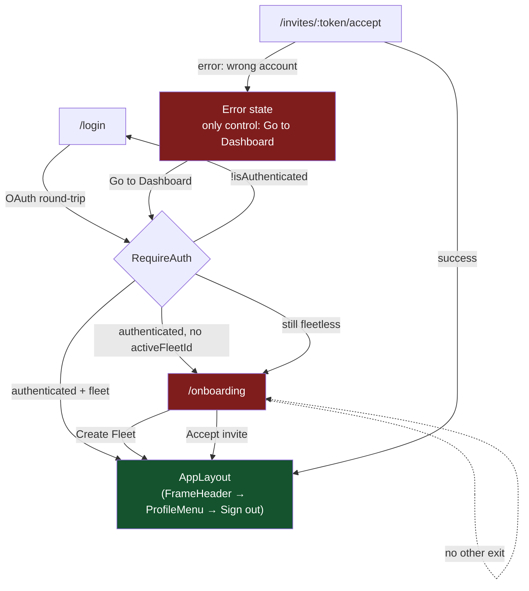
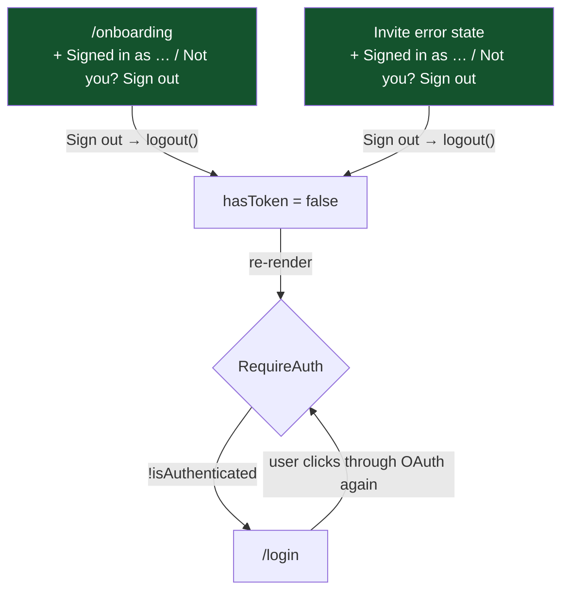

# UX Flow — Sign Out From The Fleetless Pages

Companion to `prd.md`. Records the routing topology that creates the trap, since
the fix is small but only makes sense against the shape of the problem.

## The trap today



The two red nodes are the fleetless routes. `AppLayout` — the green node — is the
only place `ProfileMenu`, and therefore the only sign-out control in the product,
is mounted. Neither red node is inside it (`App.tsx:36-53`), so neither has a way
out of the account.

Note the cycle on the right: the invite error state's `Go to Dashboard` re-enters
the guard, which sends a fleetless user back to `/onboarding`. Telling the user
"this invite was sent to a different email" and then routing them to a page with
no account controls is the sharpest form of the problem.

## After this task



No new navigation code appears anywhere on this path. `logout()` flips `hasToken`
(`AuthContext.tsx:55-60`), the guard re-renders, and its existing
`<Navigate to="/login" replace>` branch (`RequireAuth.tsx:39-43`) does the rest.
That is the whole of FR-SIGNOUT-3, and the reason the task is as small as it is.

## Placement

Onboarding, first-run (no pending invites):

```
┌─────────────────────────────────────────┐
│                                         │
│      ┌───────────────────────────┐      │
│      │ Set Up Your Fleet         │      │
│      │ Give your household…      │      │
│      │                           │      │
│      │ Fleet Name                │      │
│      │ [ The Smith Household   ] │      │
│      │                           │      │
│      │ [     Create Fleet      ] │      │ ← primary, filled
│      └───────────────────────────┘      │
│                                         │
│    Signed in as jt@gmail.com            │ ← muted, small
│    Not you? Sign out                    │ ← subordinate button
│                                         │
└─────────────────────────────────────────┘
```

With a pending invite, the invite card precedes the fleet card and the footer
stays last (FR-ONBOARD-1, FR-ONBOARD-2).

Invite-accept error state:

```
┌─────────────────────────────────────────┐
│                  ✕                      │
│        Could not accept invite          │
│   This invite was sent to a different   │
│              email address              │
│                                         │
│         [ Go to Dashboard ]             │ ← unchanged (FR-INVITE-3)
│                                         │
│    Signed in as jt@gmail.com            │
│    Not you? Sign out                    │
└─────────────────────────────────────────┘
```

Here the footer is the control that actually resolves the reported problem, and
`Go to Dashboard` is the one that loops. Ordering them this way — existing button
first, footer below — is what FR-INVITE-1 specifies, but a designer may want to
revisit the emphasis; noted as open question 2 in the PRD.
